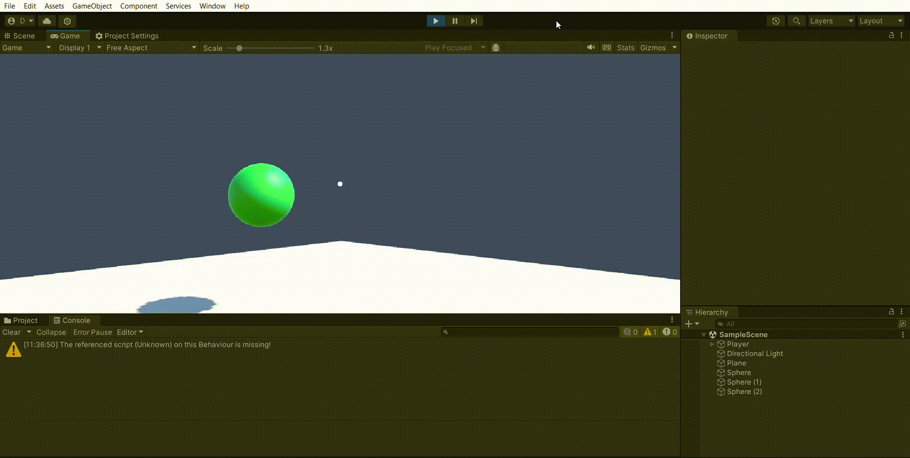

# II-P05-Cardboard-SDK

Para esta práctica hemos usado la Cardboard SDK para usar una escena de ejemplo que traía por defecto para ver como se puede utilizar la SDK. Tras esto se ha creado una segunda escena en la que se han colocado varias esferas que al mirarlas cambian de material (como hace el tesoro de la escena de ejemplo). Para poder hacer comprobaciones y el GIF de ejecución, añadí un script que permite mover la camara (simulando el movimiento de la cabeza) con la el ratón del ordenador para poder girar la cámara y posar la vista sobre todas las esferas.

## Ejecución de las esferas

